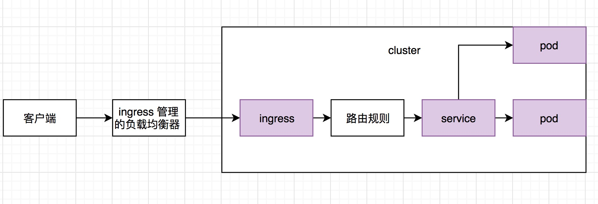

##  Ingress 是什么？
[文档](https://kubernetes.io/zh/docs/concepts/services-networking/ingress/#ingress-%E6%98%AF%E4%BB%80%E4%B9%88)

Ingress 公开了从集群外部到集群内服务的 HTTP 和 HTTPS 路由。 流量路由由 Ingress 资源上定义的规则控制。

下面是一个将所有流量都发送到同一 Service 的简单 Ingress 示例：

可以将 Ingress 配置为服务提供外部可访问的 URL、负载均衡流量、终止 SSL/TLS，以及提供基于名称的虚拟主机等能力

Ingress 控制器 通常负责通过负载均衡器来实现 Ingress，尽管它也可以配置边缘路由器或其他前端来帮助处理流量。

Ingress 不会公开任意端口或协议。 将 HTTP 和 HTTPS 以外的服务公开到 Internet 时，通常使用 Service.Type=NodePort 或 Service.Type=LoadBalancer 类型的服务。

## 

安装 Ingress 控制器

[github](https://github.com/helm/charts/tree/master/stable/nginx-ingress)

