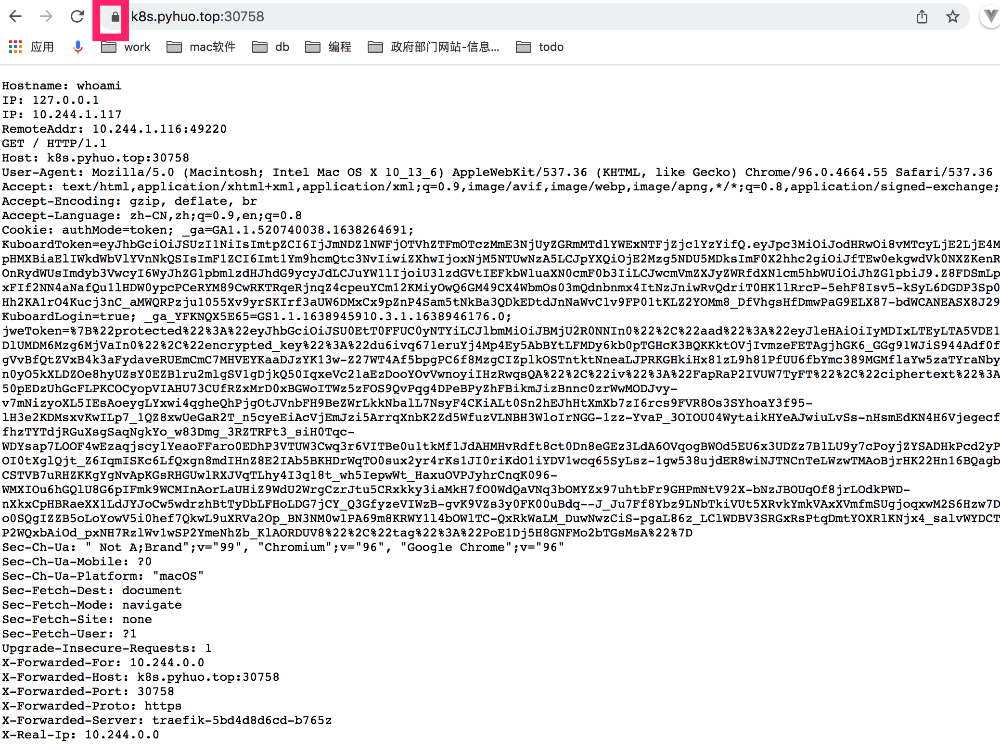

## https 证书创建
[参考](http://kubernetes.kansea.com/docs/user-guide/kubectl/kubectl_create_secret_tls/)

```
kubectl create secret tls NAME --cert=path/to/cert/file --key=path/to/key/file [--dry-run]

```

## 证书生成 secret
* 阿里云下载nginx证书.
* 执行命令生成证书.

```
cd ~/apps/config/
kubectl create secret tls whoami-tls --cert=6758654_k8s.pyhuo.top.pem --key=6758654_k8s.pyhuo.top.key
```

## 实践:whoami 提供https



yaml:  ingress/traefik/whoami-xxx.yaml


