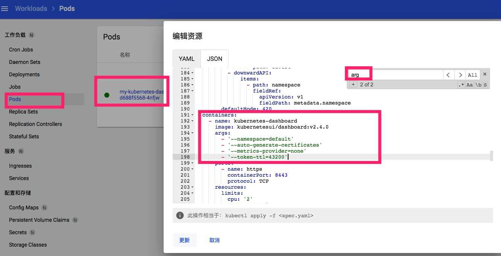

## dashboard

[helm](https://artifacthub.io/packages/helm/k8s-dashboard/kubernetes-dashboard	)

[github](https://github.com/kubernetes/dashboard)


## 版本: 5.0.4
```
helm install my-kubernetes-dashboard k8s-dashboard/kubernetes-dashboard --version 5.0.4
```


## token 默认900s过期

[github源码](https://github.com/kubernetes/dashboard/blob/master/src/app/backend/auth/api/types.go#L29)




使用yaml安装


## sh

1.查看kubernetes-dashboard命名空间下的pod
```
(venv) ➜  ~ kubectl get pod -n kubernetes-dashboard
NAME                                        READY   STATUS    RESTARTS   AGE
dashboard-metrics-scraper-c45b7869d-5dpmm   1/1     Running   0          12h
kubernetes-dashboard-7c5bb7b588-k9ggq       1/1     Running   0          12h
(venv) ➜  ~
```

2.使用label选中kubernetes-dashboard的pod
```
(venv) ➜  ~ kubectl get pod -n kubernetes-dashboard -l "k8s-app=kubernetes-dashboard"
NAME                                    READY   STATUS    RESTARTS   AGE
kubernetes-dashboard-7c5bb7b588-k9ggq   1/1     Running   0          12h
(venv) ➜  ~
```


3.获取pod name

```
export POD_NAME=$(kubectl get pods -n kubernetes-dashboard  -l "k8s-app=kubernetes-dashboard" -o jsonpath="{.items[0].metadata.name}")
```

4.暴漏服务
```
kubectl -n kubernetes-dashboard port-forward --address 0.0.0.0 $(POD_NAME) 8443:8443
```


sh:
```
kubectl -n kubernetes-dashboard port-forward --address 0.0.0.0 $(kubectl get pods -n kubernetes-dashboard  -l "k8s-app=kubernetes-dashboard" -o jsonpath="{.items[0].metadata.name}") 8443:8443
```

## dashboard url
[link](https://k8s.pyhuo.top:8443/#/workloads?namespace=_all)


## token


```
kubectl -n kubernetes-dashboard describe secret $(kubectl -n kubernetes-dashboard get secret | grep kubernetes-dashboard | awk '{print $1}')
```


```
kubectl -n kubernetes-dashboard describe secret $(kubectl -n kubernetes-dashboard get secret | grep kubernetes-dashboard | awk '{print $1}')
```


[参考文档](https://segmentfault.com/a/1190000023130407)